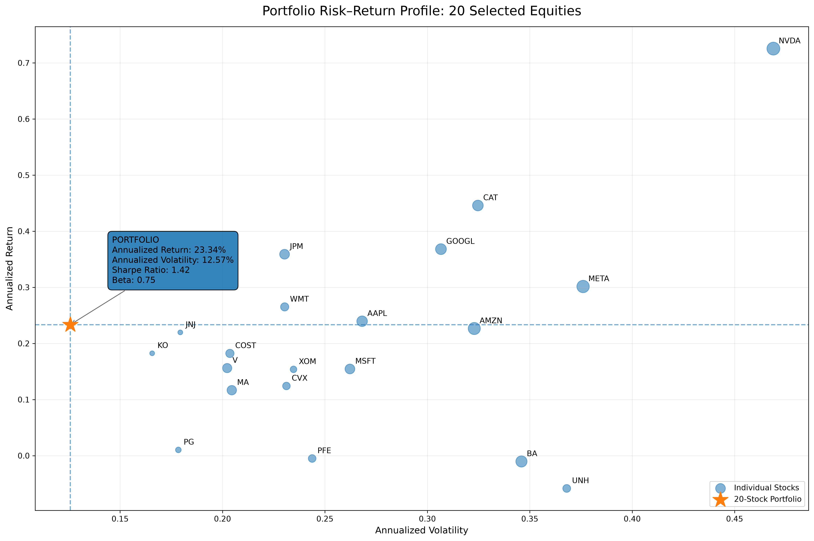
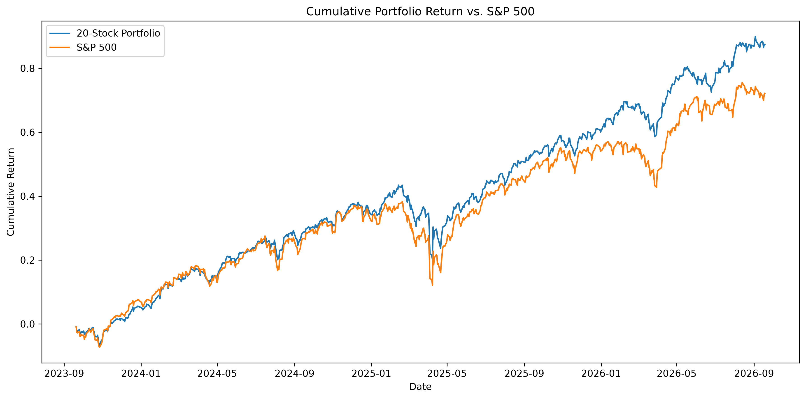
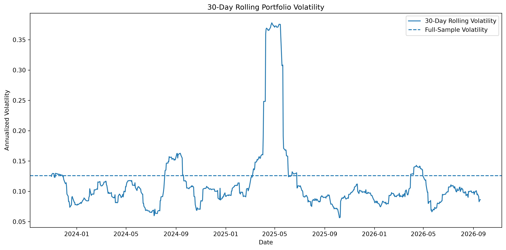
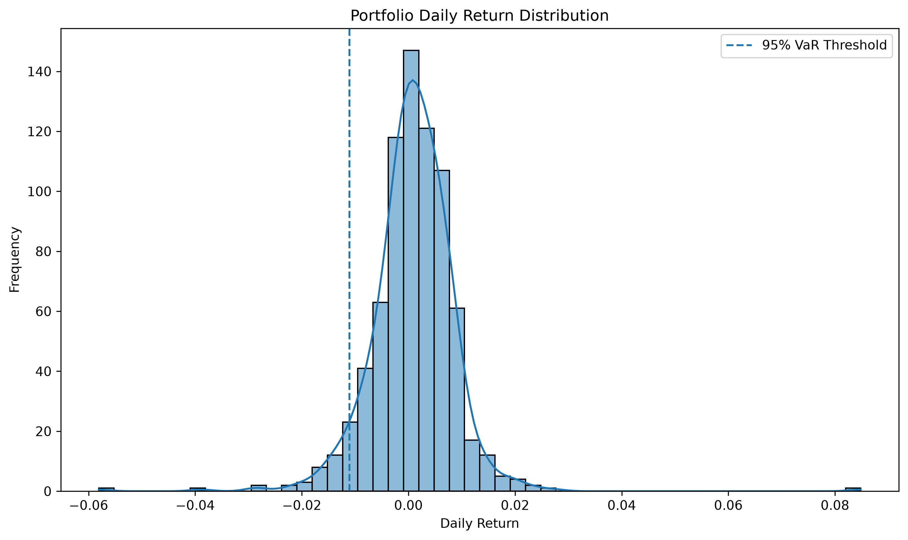
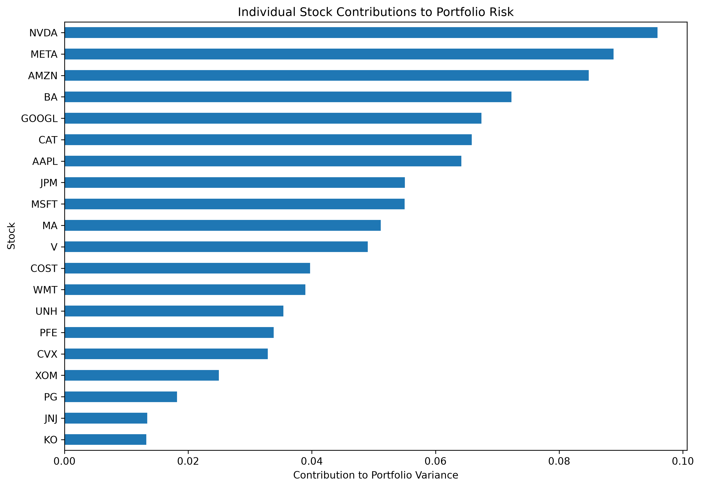
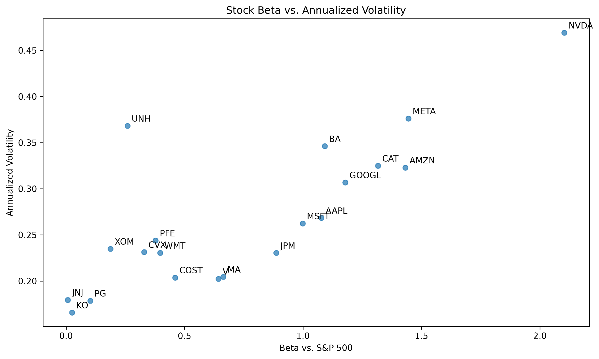

# Stock Market Portfolio Risk & Volatility Analysis

**Python | Texas A&M University | 2026**

## Project Overview

This project analyzes the risk and performance characteristics of an equal-weight portfolio consisting of 20 selected large-cap U.S. equities over approximately three years of daily market data.

Using Python, the analysis evaluates portfolio performance, volatility, downside risk, market sensitivity, and individual stock contributions to portfolio risk. The S&P 500 Index is used as the market benchmark.

Statistical methods include historical Value at Risk (VaR), Expected Shortfall, Sharpe ratios, rolling volatility, maximum drawdown, correlation analysis, portfolio risk contribution, and ordinary least squares (OLS) regression for estimating market Beta.

## Key Results

| Metric | Portfolio |
|---|---:|
| Cumulative Return | 87.05% |
| Annualized Return | 23.23% |
| Annualized Volatility | 12.57% |
| Sharpe Ratio | 1.42 |
| 95% Historical VaR | 1.10% |
| 95% Expected Shortfall | 1.73% |
| Maximum Drawdown | -16.23% |
| Beta vs. S&P 500 | 0.75 |
| S&P 500 Correlation | 0.896 |
| Peak 30-Day Rolling Volatility | 37.79% |

## Visualizations

### Portfolio Risk–Return Profile



The visualization compares annualized return and volatility across the selected stocks. Bubble size represents each stock's contribution to total portfolio variance, while the portfolio is highlighted separately.

### Portfolio vs. S&P 500



Cumulative return paths for the equal-weight portfolio and the S&P 500 benchmark over the sample period.

### Portfolio Volatility



Thirty-day rolling annualized volatility illustrates how portfolio risk changed throughout the sample period.

### Return Distribution & VaR



Historical distribution of daily portfolio returns with the 95% Value at Risk threshold indicated.

### Stock Risk Contribution



Percentage contribution of each stock to total portfolio variance under the equal-weight portfolio construction.

### Beta vs. Volatility



Relationship between individual stock Beta relative to the S&P 500 and annualized volatility.

## Portfolio Construction

The portfolio consists of 20 selected large-cap U.S. equities with:

- 5% allocation to each stock
- 100% total portfolio allocation
- Daily portfolio returns calculated as the weighted sum of individual stock returns
- Daily rebalancing to maintain equal weights

The S&P 500 Index (`^GSPC`) is used as the market benchmark.

## Data

Daily adjusted market prices were retrieved using `yfinance`.

**Sample period:** September 2023 – September 2026  
**Return observations:** 753 trading days  
**Assets:** 20 equities + S&P 500 benchmark

## Risk & Performance Analysis

The project calculates and analyzes:

- Cumulative and geometrically annualized returns
- Annualized volatility
- Sharpe ratio
- 95% historical Value at Risk
- 95% Expected Shortfall
- Maximum drawdown
- 30-day rolling volatility
- Stock return correlations
- Individual stock Beta
- Portfolio Beta
- Portfolio risk contribution

## Statistical Modeling

Ordinary least squares regression is used to estimate the portfolio's sensitivity to the S&P 500:

`Portfolio Return = α + β(S&P 500 Return) + ε`

The portfolio regression produced:

- **Beta:** 0.75
- **R²:** approximately 0.80
- **Daily return correlation:** 0.896

HC3 heteroskedasticity-robust standard errors are used for regression inference.

The analysis also implements the regression using `scikit-learn` as an independent computational check against the `statsmodels` results.

## Visualizations

The project includes visualizations of:

- Stock return correlations
- Portfolio rolling volatility
- Portfolio drawdowns
- Portfolio returns vs. S&P 500 returns
- Return distribution and historical VaR
- Individual stock risk contributions
- Stock Beta vs. annualized volatility
- Stock risk-return profiles

## Key Findings

The equal-weight portfolio generated an 87.05% cumulative return over the approximately three-year sample period, corresponding to a 23.23% geometrically annualized return.

Portfolio annualized volatility was 12.57%, below the annualized volatility observed for each individual stock in the selected universe. The portfolio produced a Sharpe ratio of 1.42 under the project's 4% annual risk-free-rate assumption.

Historical downside analysis produced a 95% VaR of 1.10% and Expected Shortfall of 1.73%. Maximum drawdown reached 16.23%, while 30-day rolling volatility reached a maximum of 37.79% during the sample period.

The portfolio's Beta of 0.75 and correlation of 0.896 with the S&P 500 indicate substantial historical co-movement with the broader market while exhibiting lower market sensitivity than the benchmark.

Risk contribution analysis demonstrates that equal capital allocations do not produce equal contributions to portfolio variance. Individual stocks exhibited different levels of market sensitivity, volatility, and contribution to overall portfolio risk.

## Limitations & Assumptions

This project is a historical risk and performance analysis rather than a forecast of future market behavior.

Important assumptions and limitations include:

- The portfolio contains a selected universe of 20 equities rather than the full S&P 500.
- Equal weights are maintained through daily rebalancing.
- Transaction costs, taxes, bid-ask spreads, and other trading frictions are excluded.
- Historical VaR and Expected Shortfall depend on the observed return distribution during the sample period.
- A constant 4% annual risk-free rate is assumed for Sharpe ratio calculations.
- Historical relationships and risk measures may change over time.
- The analysis does not imply that historical returns or risk characteristics will persist in the future.

## Repository Structure

```text
stock-portfolio-risk-analysis/
├── data/
├── figures/
├── notebooks/
│   └── portfolio_analysis.ipynb
├── src/
│   └── README.md
├── .gitignore
├── README.md
└── requirements.txt
```
## Technologies

- Python
- pandas
- NumPy
- yfinance
- matplotlib
- seaborn
- statsmodels
- scikit-learn
- SciPy
- Jupyter

## Reproducibility

Clone the repository, create a Python virtual environment, install the required packages from `requirements.txt`, and run the notebook located at:

`notebooks/portfolio_analysis.ipynb`

The notebook is designed to execute from a fresh kernel using **Run All**.

## Author

**Kieran Lundmark**

Texas A&M University

Statistics

